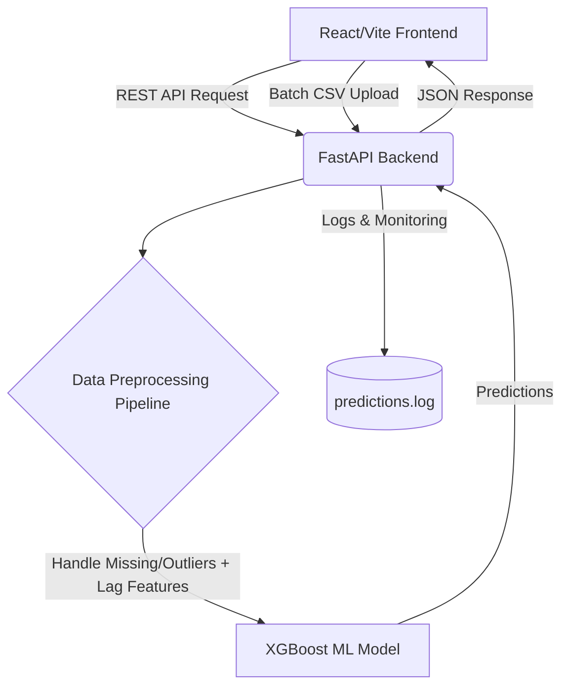

# ⚡ Energy Consumption Forecasting System (Production Ready)

A production-grade, full-stack machine learning application designed to forecast and simulate electrical grid loads using advanced time-series feature engineering and an optimized **XGBoost** model. It features a modern, responsive React dashboard and a robust FastAPI backend.

## 📖 Problem Statement
Predicting energy consumption accurately is critical for power grid stability. High-load periods caused by extreme weather (HVAC usage) or changing technology (Simultaneous EV charging) can overload grid infrastructure. This system allows stakeholders to proactively simulate these "What-If" scenarios in an interactive sandbox.

## 🏗️ Architecture



## 🛠️ Tech Stack
- **Frontend**: React, Vite, Recharts, Lucide-React, Modern Glassmorphic CSS
- **Backend**: FastAPI, Uvicorn, Pydantic (Data validation)
- **Machine Learning**: XGBoost, Scikit-Learn (GridSearchCV), Pandas, NumPy
- **Deployment**: Docker, Docker Compose

## 🚀 Getting Started

You can run this project locally using Python directly, or via Docker.

### Method 1: Using Docker (Recommended for Production)
Ensure you have Docker and Docker Compose installed.

1. Clone the repository and navigate into it.
2. Run the services:
   ```bash
   docker-compose up --build
   ```
3. Open your browser and navigate to `http://localhost:3000`. The API will run on `http://localhost:8000`.

### Method 2: Local Development (Manual Setup)

**1. Data & Model Generation:**
```bash
# Install core ML dependencies
pip install pandas numpy scikit-learn xgboost
# Generate historical data & simulate messy data trends
python generate_data.py
# Run the pipeline & train the XGBoost model
python train_model.py
```

**2. Start Backend API (FastAPI):**
```bash
cd backend
pip install -r requirements.txt
uvicorn main:app --reload --host 0.0.0.0 --port 8000
```

**3. Start Frontend UI (React):**
```bash
cd frontend
npm install
npm run dev
```

## ✨ Key Features
- **Proper Time-Series Handling**: Incorporates temporal lag features (e.g. `Temp_lag24`, `Temp_rolling_mean_24`) within the data pipeline to give the model 'memory' of past weather trends.
- **Automated Data Pipeline**: Deals with missing values (via interpolation) and caps unexpected data outliers dynamically before inference.
- **Batch Processing**: Supports raw CSV data uploads for processing thousands of predictions in milliseconds.
- **System Monitoring**: Implements basic logging (`logs/predictions.log`) tracking API health and traffic load.

## 💡 Industry Readiness
This project was upgraded from a flat Streamlit script to a modern decouple architecture perfectly suited for deployments on AWS (via ECS) or Render/Vercel pipelines. The data pipeline design mirrors real-world MLOps practices.
